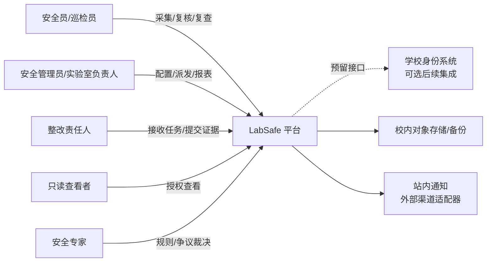
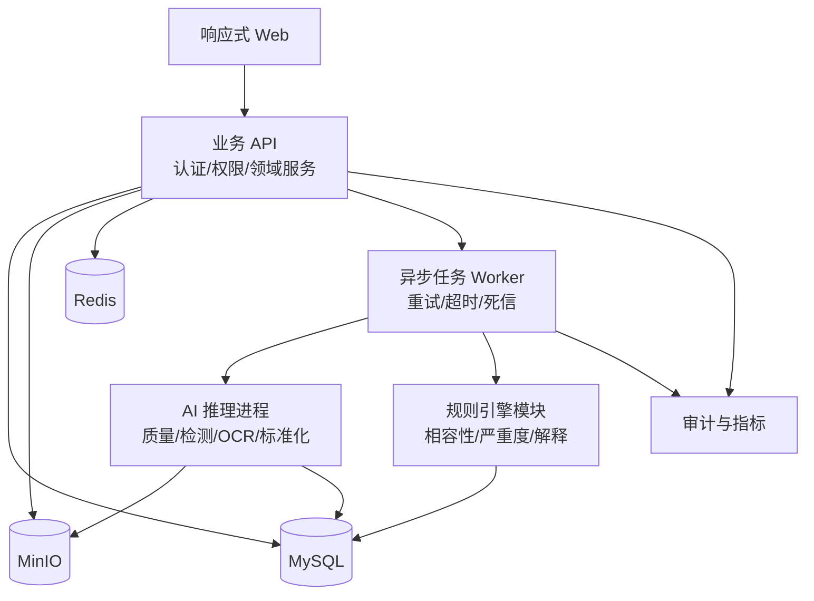
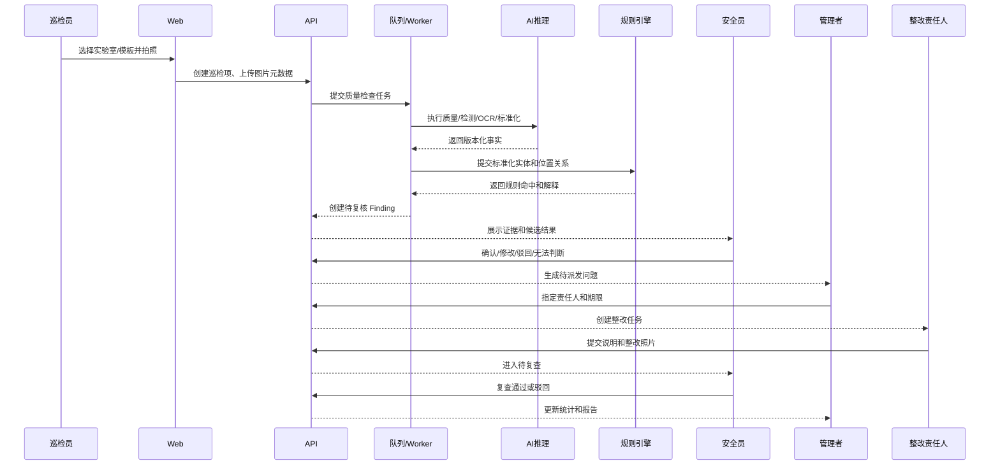

# Gate 1 总体架构与领域设计

状态：**Gate 1 已确认，待进入 Gate 2**

本文件是在 Gate 0 确认后的架构设计。它只定义边界、职责、领域模型、事件流、技术方向和架构决策，不包含可执行代码、数据库迁移、依赖锁文件或部署脚本。

## 1. Gate 1 结论摘要

- 采用“响应式 Web + 模块化单体业务服务 + 独立 AI 推理进程 + MySQL/MinIO/Redis”的首期形态。
- AI 层只输出可观测事实和候选结果；规则层输出带规则证据的风险建议；业务层负责人工确认和整改状态。
- 学校是租户，租户下支持多个学院和实验室；实验室仍是首期权限与业务操作的最小范围。
- 远程 Git 仓库为空，当前设计不需要兼容既有代码。
- 采集、推理、复核、整改和复查是一个可追踪流程，但耗时推理和报表导出通过异步任务执行。
- `Finding` 表示独立风险问题，`RemediationTask` 表示整改责任流程，两者保持一对一主关系；逾期为任务派生状态。
- 首期不引入微服务集群、Kafka 等外部事件总线、LLM 主链或复杂工作流引擎。

## 2. 产品边界

### 2.1 系统内

1. 实验室、区域、货架/柜号和责任人管理。
2. 按模板采集图片、质量检查和补拍。
3. 试剂瓶/标签检测、OCR、字段抽取和化学品标准化。
4. 同一货架/柜内的可见相邻关系与专家规则检查。
5. 安全员人工复核、无法判断和证据修正。
6. 风险问题派发、整改、复查、销项和报表。
7. 模型、规则、人工操作和数据访问审计。

### 2.2 系统外

视频流持续识别、PPE 和安全设施识别、气体/温湿度/门禁传感器、自动库存盘点、完整边缘端离线推理、气体泄漏、化学品真实成分和复杂实验操作判断。

### 2.3 责任边界

```text
AI服务       = 事实与候选，不负责最终安全结论
规则服务     = 专家批准规则的可解释计算，不负责派发任务
业务服务     = 权限、人工确认、状态机、审计和报表
安全人员     = 最终风险确认与复查销项
```

## 3. 系统上下文图



## 4. 容器与模块设计

### 4.1 容器图



### 4.2 模块职责与依赖方向

| 模块 | 职责 | 可依赖 | 不得依赖 |
|---|---|---|---|
| Identity & Access | 登录、角色、资源范围、会话 | User、Audit | AI、Rule 具体实现 |
| Laboratory | 实验室、位置、模板、责任人 | Access | Finding 状态机 |
| Inspection | 巡检、检查项、图片元数据、采集状态 | Laboratory、ObjectStore | 直接修改规则结果 |
| Inference Orchestrator | 编排质量、检测、OCR、标准化任务 | Inspection、AI、Queue | 人工确认 |
| AI Adapters | 模型推理和结构化事实输出 | ObjectStore、Model Registry | Remediation |
| Rule Engine | 规则匹配、严重度建议、解释 | Chemical、Rule Registry | 用户通知 |
| Review | Finding 复核、修改、驳回、无法判断 | Inference、Rule、Access | 直接改模型文件 |
| Remediation | 派发、整改、复查、销项 | Finding、Access、Notify | AI模型 |
| Reporting | 聚合、导出、证据索引 | 所有只读查询模块 | 写入业务状态 |
| Audit & Observability | 审计、指标、追踪、告警事件 | 所有模块 | 反向改变业务结果 |

依赖原则：业务领域模块依赖接口，不直接依赖具体模型、对象存储或通知供应商；AI 和规则输出通过版本化契约回到业务层。

## 5. 核心用户旅程与时序



## 6. 领域模型

### 6.1 聚合边界

| 聚合 | 聚合根 | 一致性边界 | 主要命令 |
|---|---|---|---|
| Laboratory | Laboratory | 实验室、位置和授权关系 | 建档、归档、授权 |
| Template | InspectionTemplate | 模板和检查项定义 | 发布、停用、复制 |
| Inspection | Inspection | 一次巡检及其检查项 | 开始、提交、完成、取消 |
| Inference | InferenceRun | 一次输入的模型/规则结果 | 运行、重试、失败、完成 |
| Finding | Finding | 一个独立问题及复核记录 | 确认、修改、驳回、无法判断 |
| Remediation | RemediationTask | 一个问题的责任和整改状态 | 派发、接收、提交、复查、销项 |
| RuleSet | RuleSetVersion | 一组规则版本和审批记录 | 草稿、审批、发布、回滚 |
| Report | ReportExport | 一次报表生成任务 | 创建、生成、下载、过期 |

### 6.2 核心实体关系

```text
Tenant [假设] 1---N Laboratory
Laboratory 1---N Location
Laboratory 1---N Inspection
Inspection 1---N InspectionItem
InspectionItem 1---N AssetImage
InspectionItem 1---N InferenceRun
InferenceRun 1---N Finding
Finding 1---1 RemediationTask
Finding 1---N ReviewAction
RuleSetVersion 1---N Rule
AnyResource 1---N AuditEvent
```

### 6.3 状态与不变量

#### InspectionItem

`draft -> uploaded -> quality_checking -> needs_retake | processing -> needs_review -> reviewed`

不变量：质量检查失败的图片不能进入正式推理；检查项没有成功图片不能标记为已完成。

#### Finding

`ai_detected -> needs_review -> confirmed | rejected | cannot_determine`

确认后才允许创建整改任务；被驳回的 Finding 仍保留推理证据和驳回原因。

#### RemediationTask

`pending_dispatch -> in_progress -> pending_recheck -> closed`

旁路状态：`overdue`、`rejected`、`cannot_remediate`。

不变量：责任人不能自己完成最终复查销项；没有复查证据不能进入 `closed`；`overdue` 由期限派生且不覆盖业务主状态。

## 7. 领域事件

| 事件 | 产生模块 | 消费者 | 语义 |
|---|---|---|---|
| `InspectionCreated` | Inspection | Web、Audit | 巡检已创建 |
| `ImageUploaded` | Inspection | Queue、Audit | 图片可处理 |
| `QualityCheckFailed` | Inference | Web、Inspection | 必须补拍 |
| `InferenceCompleted` | Inference | Review、Audit | 事实结果可复核 |
| `RuleEvaluationCompleted` | Rule | Review、Reporting | 规则证据已生成 |
| `FindingConfirmed` | Review | Remediation、Reporting | 问题已由安全员确认 |
| `FindingRejected` | Review | Reporting、Audit | AI建议被驳回 |
| `RemediationDispatched` | Remediation | Notify、Audit | 已指定责任人 |
| `EvidenceSubmitted` | Remediation | Review、Audit | 等待复查 |
| `RemediationClosed` | Remediation | Reporting、Audit | 问题已销项 |
| `RuleVersionPublished` | Rule | Inference、Audit | 新规则可用于新任务 |

事件首期通过数据库 Outbox + Redis 队列实现；不引入外部 Kafka 等事件平台。该方案已获确认。

## 8. 同步与异步边界

### 同步

- 登录、权限校验、实验室/模板查询。
- 创建巡检、取得上传凭证。
- 读取已生成的推理结果。
- 人工复核和状态转移。
- 查询看板和审计记录。

### 异步

- 图像质量检查后的完整推理流水线。
- 报表生成。
- 批量困难样本导出。
- 站内通知。
- 统计聚合和周期性监控任务。

所有异步任务必须具备幂等键、最大重试次数、退避策略、死信记录和人工重放入口。

## 9. 技术选型与替代方案

| 能力 | 首选方向 | 替代方案 | 选择理由 | 锁定风险 |
|---|---|---|---|---|
| API | FastAPI + Python | Django REST、Go Fiber | 适合 AI 服务和类型化 API | 团队 Python 能力需确认 |
| Web | Vue 3 + TypeScript + Vite | React/TypeScript | 组件生态、开发效率和响应式 Web 适配 | 组件库和状态管理需在 Gate 2 锁定 |
| DB | MySQL | PostgreSQL | 校内运维可获得性和团队接受度较高 | JSON 查询、锁语义和迁移兼容性需在 Gate 2 验证 |
| 对象存储 | MinIO | 本地文件、S3兼容存储 | 本地部署和 S3 API | 磁盘/备份容量需确认 |
| 队列 | Celery + Redis | Redis Streams、RabbitMQ | Python 生态成熟，支持重试、定时任务、任务状态和 Worker | 长任务可靠性需压测 |
| 检测 | YOLO/RT-DETR 基线 | 其他检测框架 | 成熟、便于快速基线 | 许可证和 GPU 需确认 |
| OCR | PaddleOCR 基线 | Tesseract、云 OCR | 中文标签适配性较好 | 模型体积和 CPU 性能 |
| 规则 | Python 规则模块 + JSON Schema | Drools、OPA | 首期规则数量小且易调试 | DSL 演进需治理 |
| 认证 | 本地账号 | OIDC/SAML | 不阻塞试点 | 后续统一认证接入成本 |
| 观测 | 结构化日志 + OpenTelemetry + Prometheus | Grafana | 兼顾 20 天周期和请求/任务/模型版本关联 | Grafana 可后续接入 |

本表的具体版本、许可证和锁定策略在 Gate 2 详细设计中确认。

## 10. 非功能目标

| 类别 | Gate 1 目标 | 验证方式 |
|---|---|---|
| 延迟 | GPU/推荐配置完整推理 P95 ≤30 秒；CPU 模式允许异步超时但必须可追踪、可重试、可人工兜底 | P95/P99 性能测试 |
| 可用性 | 试点期间核心 API 和队列可用 | 健康检查、故障注入 |
| 安全 | 默认最小权限、审计全量状态变更 | 越权和审计测试 |
| 可追踪 | 每个结果关联请求、任务、模型和规则版本 | 端到端证据检查 |
| 可恢复 | 应用、数据库、图片均可备份恢复 | 恢复演练 |
| 可维护 | 模型/规则/业务可独立版本化 | 发布和回滚演练 |
| 隐私 | 原图校内保存，人员影像最小化处理 | 访问审计和脱敏检查 |
| 可扩展 | 外部通知和统一认证通过适配器扩展 | 契约测试 |

建议首期目标：核心 API 月度可用性 ≥99%；质量检查 P95 ≤5 秒；GPU/推荐配置完整推理 P95 ≤30 秒；RPO ≤24 小时；RTO ≤4 小时。CPU 模式允许异步超时，但不得产生未经人工确认的最终风险结论。

### 最低目标服务器配置

由于校内服务器没有既定约束，首期最低目标为 8 个逻辑 CPU、16 GB 内存、100 GB 系统 SSD、500 GB 数据 SSD、校内 1 Gbps 局域网；GPU 非必需；优先支持 Docker，无法容器化时支持进程方式启动。推荐配置为 16 个逻辑 CPU、32 GB 内存、1 TB 数据 SSD，可选 8 GB 以上 NVIDIA GPU 和独立备份盘。

### CPU 降级路径

无 GPU 或 GPU 不可用时，使用轻量模型、限制输入分辨率、批大小固定为 1、AI Worker 并发降至 1～2，优先保留质量检查、OCR 和规则匹配，非核心类别可暂停。完整推理继续走异步队列；超时显示“处理中”，失败进入重试/死信；OCR 失败允许人工录入；无法标准化时不得执行相容性结论。模型、规则、前端资源和依赖必须本地化，确保断公网但校内局域网可处理新图片。

## 11. Gate 1 ADR

### ADR-001：首期采用模块化单体而非微服务集群

- 状态：已确认
- 背景：团队需要六个月内完成真实试点，模块数量有限，部署环境为单校内服务器。
- 选项：微服务集群、模块化单体、纯脚本式原型。
- 决策：采用模块化单体，AI 推理作为独立进程/适配器运行。
- 影响：降低部署和联调成本；要求模块接口和依赖方向严格维护。
- 回滚：当负载或团队边界明确后，可按模块拆出独立服务；领域 API 不直接绑定进程内调用。

### ADR-002：AI输出事实，规则输出建议，人工确认最终风险

- 状态：已确认
- 背景：项目涉及实验室安全，模型可能漏报、误报或无法判断。
- 选项：模型直接给最终结论、规则直接自动派发、事实/规则/人工分层。
- 决策：采用三层分离，所有高风险结果必须人工确认。
- 影响：增加复核步骤，但满足责任边界和审计要求。
- 回滚：不允许回滚为自动安全结论；只能调整复核门槛和规则版本。

### ADR-003：异步推理，业务状态同步确认

- 状态：已确认
- 背景：完整推理目标为 30 秒内，但现场连续拍摄不能被单张推理阻塞。
- 选项：全同步、全异步、推理异步且复核/状态同步。
- 决策：采用第三种方案。
- 影响：需要任务状态、重试、死信和处理中界面。
- 回滚：队列不可用时允许受控同步 CPU 降级，但不能绕过审计和版本记录。

### ADR-004：规则版本不可变，历史记录绑定原版本

- 状态：已确认
- 背景：规则调整不能改变历史安全判断的可解释性。
- 选项：原地修改、全量重算、不可变版本。
- 决策：不可变版本；新任务使用新版本，历史记录保留旧版本。
- 影响：需要规则登记、发布、回滚和回归测试。
- 回滚：发布新版本或恢复旧版本为当前版本，不删除已发布版本。

### ADR-005：首期不将 LLM 放入安全判定主链

- 状态：已确认
- 背景：当前已确认的主链是检测、OCR、实体标准化和专家规则；LLM 可能引入幻觉和离线部署复杂度。
- 选项：LLM 参与最终判断、LLM 仅做解释、首期不使用 LLM。
- 决策：首期不接入 LLM；未来如自然语言解释价值足够高，只能作为独立、可禁用、可回退的解释旁路单独评审。
- 影响：减少幻觉、成本和合规风险，但自然语言解释灵活性较低。
- 回滚：若后续引入 LLM，必须作为独立、可禁用的解释模块，并经过单独 Gate 评审。

### ADR-006：学校为租户，实验室为首期权限边界

- 状态：已确认
- 背景：一个学校下未来需要多个学院和实验室，必须避免跨学校数据访问。
- 选项：学校作为租户、实验室作为租户、无租户模型。
- 决策：学校作为租户；租户下建学院和实验室层级；首期操作权限按实验室范围控制，所有业务表保留 `tenant_id`。
- 影响：需要租户级隔离测试，同时保留实验室级资源授权。
- 回滚：若试点只部署单学校，可运行单租户模式，但不删除租户字段和约束。

### ADR-007：Finding 主实体，整改任务默认一对一

- 状态：已确认
- 背景：一个风险问题需要独立复核、审计和整改闭环，但未来可能拆成多个整改动作。
- 决策：`Finding` 是主实体；`RemediationTask` 从属于 Finding；首期默认一对一，数据关系和 API 预留一对多扩展。
- 影响：首期流程简单，未来可支持一个问题拆分多个责任动作；查询和销项语义必须在 Gate 2 明确。
- 回滚：不允许删除 Finding 以“完成”整改；只能关闭其任务并保留关系。

### ADR-008：AI 推理独立进程/服务

- 状态：已确认
- 背景：需要 GPU 资源隔离、模型热更新、独立扩缩容和模型版本追踪，同时保持业务主应用可控。
- 决策：业务主应用采用模块化单体；AI 推理作为独立进程或服务，通过版本化 HTTP/gRPC 契约调用；MQ 仅用于异步任务编排，不直接暴露模型内部状态。
- 影响：增加服务契约、超时、重试、熔断、幂等和独立日志要求，但为后续拆分和资源隔离保留空间。
- 回滚：推理服务不可用时进入重试/待处理或 CPU 降级；不得绕过证据和人工复核。

### ADR-009：20天周期采用分阶段评测集

- 状态：已确认
- 背景：项目周期约 20 天，无法等待第一个月才冻结测试集和确定门槛。
- 选项：沿用一个月冻结、完全不设门槛、早期小型基线集 + 后续扩展集。
- 决策：第 1-3 天冻结最小基线集和标注规范，第 4-7 天形成临时门槛用于迭代，第 8-10 天冻结候选验收集；最终报告同时区分临时门槛和正式验收结果。
- 影响：不能声称拥有大规模稳定泛化指标，但能在短周期内保持评测可重复和诚实。
- 回滚：若现场数据不足，明确报告样本量、置信区间和未覆盖场景，不通过改测试集制造达标结果。

## 12. Gate 1 未决事项

1. Gate 2 需要验证 MySQL JSON 查询、索引、锁语义和迁移策略。
2. Gate 2 需要锁定 Vue 组件库、状态管理和 OpenAPI 类型生成方案。
